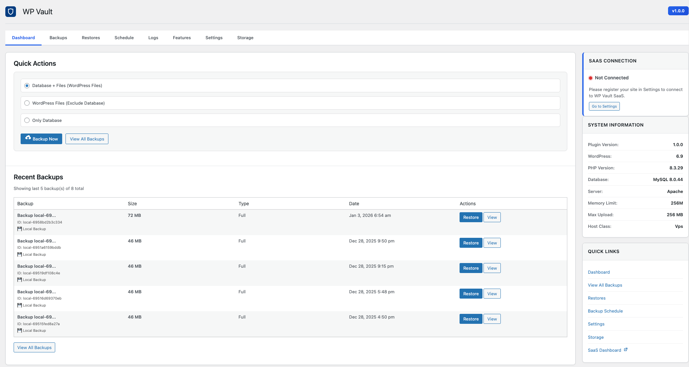
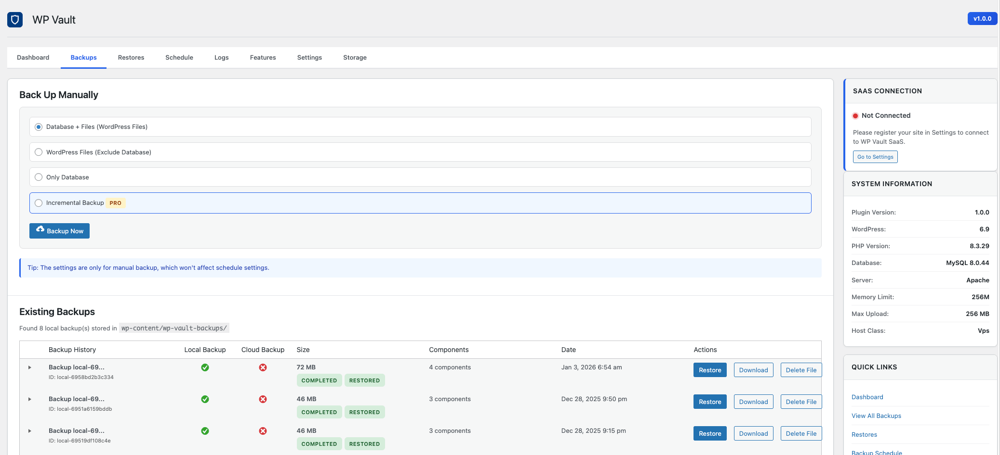

# 🔒 WP Vault

<div align="center">


**Ultimate WordPress Backup & Optimization Platform**

[](https://wordpress.org/)
[](https://www.php.net/)
[](LICENSE)
[](https://github.com/wpvault/wp-vault-plugin)

[Features](#-features) • [Installation](#-installation) • [Documentation](#-documentation) • [Contributing](#-contributing) • [Support](#-support)

</div>

---

## 📋 Table of Contents

- [Overview](#-overview)
- [Features](#-features)
- [Requirements](#-requirements)
- [Installation](#-installation)
- [Quick Start](#-quick-start)
- [Configuration](#-configuration)
- [Usage](#-usage)
- [Storage Providers](#-storage-providers)
- [Screenshots](#-screenshots)
- [FAQ](#-faq)
- [Contributing](#-contributing)
- [Changelog](#-changelog)
- [Support](#-support)
- [License](#-license)

## 🎯 Overview

WP Vault is a comprehensive backup and optimization solution designed specifically for WordPress. It provides automatic backups, multi-storage support, incremental backups, and one-click restore functionality. Whether you're managing a single blog or multiple client sites, WP Vault ensures your WordPress data is always protected.

### Why WP Vault?

- ✅ **Multi-Storage Support** - Use your preferred cloud storage provider
- ✅ **Incremental Backups** - Save time and bandwidth with smart incremental backups
- ✅ **Free Cloud Storage** - 3GB free storage on WP Vault Cloud
- ✅ **One-Click Restore** - Restore your entire site or specific components
- ✅ **Enterprise Ready** - Perfect for agencies managing multiple sites
- ✅ **Secure** - End-to-end encryption for all backups

## ✨ Features

### 🔄 Backup Features

- **Automatic Scheduled Backups** - Daily, weekly, or custom intervals
- **Incremental Backups** - Only backup changed files, saving time and storage
- **Full Site Backups** - Complete database and file system backups
- **Selective Backups** - Choose specific directories or database tables
- **Compression** - Automatic ZIP compression to reduce storage usage

### ☁️ Storage Options

- **WP Vault Cloud** - 3GB free storage included
- **Amazon S3** - Full S3 compatibility
- **Google Cloud Storage** - Native GCS support
- **Google Drive** - Direct Google Drive integration
- **FTP/SFTP** - Traditional file transfer support
- **MinIO** - Self-hosted S3-compatible storage
- **Wasabi** - Cost-effective cloud storage
- **Backblaze B2** - Affordable cloud storage

### 🔧 Restore Features

- **One-Click Restore** - Restore entire site with a single click
- **Granular Restore** - Restore only files or database
- **Cross-Server Restore** - Restore to different servers
- **URL Replacement** - Automatic URL updates during restore
- **Preview Before Restore** - Review backup contents before restoring

### 🛡️ Security & Reliability

- **End-to-End Encryption** - All backups are encrypted
- **Secure Storage** - Industry-standard security practices
- **Backup Verification** - Automatic integrity checks
- **Activity Logging** - Complete audit trail
- **Site Health Monitoring** - Regular heartbeat checks

### 🚀 Optimization (Coming Soon)

- Image optimization
- Database cleanup
- Performance monitoring

## 📦 Requirements

- **WordPress**: 5.8 or higher
- **PHP**: 7.4 or higher
- **MySQL**: 5.6 or higher
- **Memory**: 128MB minimum (256MB recommended)
- **Storage**: Varies based on backup size

### PHP Extensions

- `zip` - For backup compression
- `curl` - For API communication
- `openssl` - For encryption
- `mbstring` - For string handling

## 🚀 Installation

### Method 1: WordPress Admin (Recommended)

1. Download the latest release from [GitHub Releases](https://github.com/wpvault/wp-vault-plugin/releases)
2. Go to **Plugins → Add New → Upload Plugin**
3. Choose the downloaded ZIP file
4. Click **Install Now**
5. Activate the plugin

### Method 2: Manual Installation

1. Clone or download this repository
2. Upload the `wp-vault-plugin` folder to `/wp-content/plugins/`
3. Activate the plugin through the WordPress admin panel

```bash
cd wp-content/plugins
git clone https://github.com/wpvault/wp-vault-plugin.git wp-vault
```

### Method 3: Composer (For Developers)

```bash
composer require wpvault/wp-vault-plugin
```

## 🎬 Quick Start

1. **Activate the Plugin**

   - Navigate to **Plugins** in your WordPress admin
   - Find **WP Vault** and click **Activate**

2. **Register Your Site**

   - Go to **WP Vault → Dashboard**
   - Click **Register Site** to create your account
   - You'll receive 3GB of free cloud storage

3. **Configure Storage** (Optional)

   - Go to **WP Vault → Settings**
   - Choose your preferred storage provider
   - Enter your credentials and test the connection

4. **Create Your First Backup**

   - Go to **WP Vault → Backups**
   - Click **Backup Now**
   - Wait for the backup to complete

5. **Restore** (When Needed)
   - Go to **WP Vault → Restores**
   - Select a backup from the list
   - Click **Restore** and confirm

## ⚙️ Configuration

### Storage Configuration

#### Amazon S3

```
Access Key ID: [Your Access Key]
Secret Access Key: [Your Secret Key]
Bucket Name: [Your Bucket Name]
Region: [Your Region, e.g., us-east-1]
```

#### Google Cloud Storage

```
Service Account JSON: [Upload JSON Key File]
Bucket Name: [Your Bucket Name]
```

#### Google Drive

```
Client ID: [Your Client ID]
Client Secret: [Your Client Secret]
```

#### FTP/SFTP

```
Host: [Your FTP Host]
Username: [Your Username]
Password: [Your Password]
Port: [21 for FTP, 22 for SFTP]
```

### Backup Settings

- **Backup Schedule**: Set automatic backup intervals
- **Backup Retention**: Configure how many backups to keep
- **Compression Level**: Adjust compression settings
- **Exclude Files**: Specify files/directories to exclude

## 📖 Usage

### Creating a Backup

1. Navigate to **WP Vault → Backups**
2. Click **Backup Now**
3. Select backup type:
   - **Full Backup** - Everything
   - **Files Only** - Only file system
   - **Database Only** - Only database
4. Click **Start Backup**
5. Monitor progress in real-time

### Restoring a Backup

1. Navigate to **WP Vault → Restores**
2. Select a backup from the list
3. Choose restore options:
   - **Full Restore** - Complete site restore
   - **Files Only** - Restore only files
   - **Database Only** - Restore only database
4. Configure URL replacement if restoring to a different domain
5. Click **Start Restore**

### Scheduling Backups

1. Go to **WP Vault → Settings**
2. Navigate to **Backup Schedule**
3. Enable **Automatic Backups**
4. Set your preferred schedule:
   - Daily
   - Weekly
   - Custom (cron expression)
5. Save settings

## ☁️ Storage Providers

### Supported Providers

| Provider             | Status    | Free Tier | Notes                     |
| -------------------- | --------- | --------- | ------------------------- |
| WP Vault Cloud       | ✅ Active | 3GB       | Included with plugin      |
| Amazon S3            | ✅ Active | -         | Full S3 compatibility     |
| Google Cloud Storage | ✅ Active | -         | Requires service account  |
| Google Drive         | ✅ Active | 15GB      | Free with Google account  |
| FTP                  | ✅ Active | -         | Standard FTP protocol     |
| SFTP                 | ✅ Active | -         | Secure file transfer      |
| MinIO                | ✅ Active | -         | Self-hosted S3-compatible |
| Wasabi               | ✅ Active | -         | S3-compatible API         |
| Backblaze B2         | ✅ Active | -         | S3-compatible API         |

## 📸 Screenshots

### Dashboard


_Main dashboard showing backup overview and site health_

### Backup Management


_List of all backups with status and actions_

### Storage Settings


_Storage configuration and connection testing_

### Restore Options


_Restore interface with granular options_

## ❓ FAQ

### Is WP Vault free?

Yes! WP Vault offers a free tier with 3GB of cloud storage. You can also use your own storage providers (S3, Google Drive, etc.) at no additional cost.

### What storage providers are supported?

WP Vault supports Amazon S3, Google Cloud Storage, Google Drive, FTP, SFTP, MinIO, Wasabi, and Backblaze B2. More providers are being added regularly.

### Can I restore to a different server?

Absolutely! WP Vault allows you to restore backups to any WordPress installation, even on a different server or domain. The plugin automatically handles URL replacement.

### How does incremental backup work?

Incremental backups only upload files that have changed since the last backup. This saves bandwidth, storage space, and backup time, especially for large sites.

### Is my data secure?

Yes! All backups are encrypted end-to-end. We follow industry-standard security practices and never store your credentials.

### Can I use multiple storage providers?

Yes, you can configure multiple storage providers and choose which one to use for each backup.

### What happens if a backup fails?

WP Vault will automatically retry failed backups and notify you of any issues. You can also view detailed logs in the admin panel.

### Do I need technical knowledge to use WP Vault?

No! WP Vault is designed to be user-friendly. The one-click backup and restore features make it accessible to users of all technical levels.

## 🤝 Contributing

We welcome contributions from the community! Here's how you can help:

### How to Contribute

1. **Fork the Repository**

   ```bash
   git clone https://github.com/wpvault/wp-vault-plugin.git
   cd wp-vault-plugin
   ```

2. **Create a Feature Branch**

   ```bash
   git checkout -b feature/your-feature-name
   ```

3. **Make Your Changes**

   - Follow WordPress coding standards
   - Add comments and documentation
   - Test your changes thoroughly

4. **Submit a Pull Request**
   - Provide a clear description of your changes
   - Reference any related issues
   - Include screenshots if applicable

### Development Setup

```bash
# Install dependencies (if any)
composer install

# Run tests (if available)
phpunit

# Check code standards
phpcs --standard=WordPress .
```

### Code Standards

- Follow [WordPress Coding Standards](https://developer.wordpress.org/coding-standards/wordpress-coding-standards/)
- Use meaningful variable and function names
- Add PHPDoc comments for all functions
- Test on multiple WordPress versions

### Reporting Issues

Found a bug? Please [open an issue](https://github.com/wpvault/wp-vault-plugin/issues) with:

- WordPress version
- PHP version
- Plugin version
- Steps to reproduce
- Error messages (if any)
- Screenshots (if applicable)

## 📝 Changelog

### 1.0.0 (2024-01-XX)

- 🎉 Initial release
- ✅ Multi-storage support (S3, GCS, Google Drive, FTP, SFTP)
- ✅ Site registration and heartbeat monitoring
- ✅ Manual backup creation
- ✅ Backup listing and management
- ✅ Storage connection testing
- ✅ Basic restore functionality
- ✅ Incremental backup support
- ✅ Compression support

## 💬 Support

### Get Help

- **Documentation**: [docs.wpvault.io](https://docs.wpvault.io)
- **GitHub Issues**: [Report a Bug](https://github.com/wpvault/wp-vault-plugin/issues)
- **Email Support**: support@wpvault.io
- **Community Forum**: [forum.wpvault.io](https://forum.wpvault.io)

### Commercial Support

For priority support, custom development, or enterprise licensing, please contact:

- **Email**: enterprise@wpvault.io
- **Website**: [wpvault.io/enterprise](https://wpvault.io/enterprise)

## 📄 License

This software is proprietary and confidential. All rights reserved.

Copyright (c) 2024 WP Vault

**Important**: This software is protected by copyright laws. You may not copy, duplicate, or sell this software without explicit permission from WP Vault. However, we welcome contributions through pull requests.

See [LICENSE](LICENSE) file for full terms and conditions.

For licensing inquiries: licensing@wpvault.io

## 🙏 Acknowledgments

- WordPress community for inspiration and best practices
- All contributors who help improve WP Vault
- Storage provider SDKs and libraries

## 🔗 Links

- **Website**: [wpvault.io](https://wpvault.io)
- **Documentation**: [docs.wpvault.io](https://docs.wpvault.io)
- **GitHub**: [github.com/wpvault/wp-vault-plugin](https://github.com/wpvault/wp-vault-plugin)
- **Support**: [support.wpvault.io](https://support.wpvault.io)

---

<div align="center">

**Made with ❤️ by the WP Vault Team**

[⭐ Star us on GitHub](https://github.com/wpvault/wp-vault-plugin) • [🐛 Report Bug](https://github.com/wpvault/wp-vault-plugin/issues) • [💡 Request Feature](https://github.com/wpvault/wp-vault-plugin/issues)

</div>
